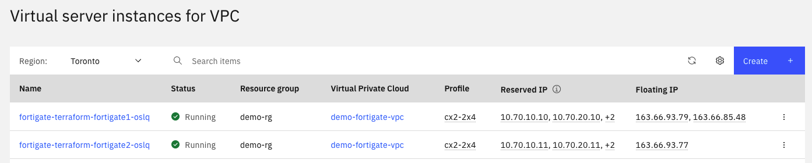

# Fortigate Active-Passive HA Pair with Infrastructure

## Overview

**IMPORTANT**: This terraform is provided as an example, without support or guarantee.  Comments and PRs are welcome.  

The Fortigate AP HA Pair is an offering in the [IBM Cloud catalog](https://cloud.ibm.com/catalog/content/ibm-fortigate-AP-HA-terraform-deploy-5dd3e4ba-c94b-43ab-b416-c1c313479cec-global)

This terraform provisions all of the pre-requisite infrastructure required for the deployment of the catalog offering as well as provisioning the HA Pair.  

1. One Edge VPC in the selected MZR
1. For each selected zone, 4 subnets (public, internal, ha and management)
1. For each zone, ACL to allow traffic from a set of allowed IPs, as well as outbound and response traffic to support the operation of the Fortigates
1. Security Group to allow traffic internally, and from allowed IPs
1. Updates to the default route table and a secondary route table for the flow of traffic
1. Key ring and keys for encrypting the boot and data volumes of the Fortigate servers.
1. Network Flow Logs for the VPC (optional)
1. Connection to Transit Gateway (optional)


The Fortigate AP HA module is based on the terraform [here](https://github.com/fortinet/ibm-fortigate-AP-HA-terraform-deploy) (which backs the catalog offering) with the following modifications:

* Log and boot volumes are encrypted with provided key
* Resource Group variable was added and is used with all resources so that they don't go into the default resource group
* A Service ID and API Key are created to authorize the IBM SDN Connector, instead of using the IBM API Key used to run the terraform
* IP Spoofing is enabled for the internal interface

You can view a diagram of the Fortigate deployment in the README of the git repository above, or [in the local module](./modules/fortigate-ha/README.md).


## Pre-requisities

1. An [ssh key resource](https://cloud.ibm.com/docs/ssh-keys?topic=ssh-keys-adding-an-ssh-key) in IBM Cloud in the region where you will be doing the deployment.  You will need the name of this resource.

1. A Key Protect or HPCS instance.  You will need the crn and guid of this instance.  A key ring and keys will be created for encrypting the Fortigate volumes.  If Flow Logs are selected, then another key for the flow logs will be created.

1. Cloud Object Storage (optional).  If choose to have flow logs, then you need a COS instance.  A bucket will be created in that instance.  You need the crn and guid of this instance.

1. Transit Gateway (optional).  You can optionally add a connection for the VPC to an existing Transit Gateway.  You will need the guid of the Transit Gateway.

## Input Variables

| Name | Description | Type | Default/Example | Required |
| ---- | ----------- | ---- | ------- | -------- |
| ibmcloud_api_key | API Key used to provision resources.  Your key must be authorized to perform the actions in this script. **IMPORTANT: Make sure the API Key is authorized to configure IP Spoofing on VPC Infrastructure** | string | N/A | yes |
| region | MZR to provision the Fortigate AP HA pairs. List all available regions with: "ibmcloud regions". | string | Default: "ca-tor" | yes |
| prefix | Short string that will be used to prefix all resource names | list(string) | N/A | yes |
| vpc_cidrs | An array of address prefixes for the IP ranges available in each zone of the VPC.  You can use the defaults, but be aware of conflicts with other VPCs or networks that you are connecting to.  | string | ["10.70.0.0/18","10.80.0.0/18", "10.90.0.0/18"] | Use default or provide your own |
| fortigate_zone_subnet_cidrs | A map of zone to subnet cidrs for the Fortigate subnets.  The default will provision in zones 1 and 3. | map | See default below | use the default or provide your own | 
| fortigate_allowed_cidrs | Array of CIDRs that will be allowlisted access to the Fortigate network. If no CIDRs are provided, you will not be able to access the servers to set up or load licenses.  | list(string) | By default, this is an empty array `[]`. An example with one allowed IP `["99.99.99.99/32"]` | no - terraform will run as is, but you will need to add IPs to the ACL and SG later. |
| ssh_key_name | Name of SSH Key resource to use with all servers | string | N/A | Yes | 
| kms_crn | CRN of KMS instance (Key Protect or Hyper Protect Crypto Services).  Will be used for key ring and keys to encrypt server volumes and flow logs (if selected.) | string | N/A |yes | 
| kms_guid | GUID of KMS instance (Key Protect or Hyper Protect Crypto Services).  Will be used for key ring and keys to encrypt server volumes and flow logs (if selected.) | string | N/A |yes | 
| cos_crn | CRN of COS instance in which to add a bucket for Network Flow Logs. | string | null | No - if you leave the null default, then Network Flow Logs will not be provisioned | 
| cos_guid | If you want Network Flow Logs, provide the cos guid as well as crn | string | null | No - if you leave the null default, then Network Flow Logs will not be provisioned | 
| connect_to_transitgateway | Set to false if you do not want to connect VPC to a transit gateway | bool | true | no | 
| transit_gateway_id | If `connect_to_transitgateway` is true, you must provide a GUID of the Transit Gateway | string | N/A | no | 

### Default fortigate_zone_subnet_cidrs

You can view the default in `variables.tf`.  The default will provision a pair in zones 1 and 3 as indicated by the left side of the map.  The four cidrs are for the public, internal, ha and management subnets, respectively.
```
{
    1 = ["10.70.10.0/24","10.70.20.0/24","10.70.30.0/24","10.70.40.0/24"]
    3 = ["10.90.10.0/24","10.90.20.0/24","10.90.30.0/24","10.90.40.0/24"]
}
```

## Output Variables

Output is in the form of JSON and shows all the details of each pair you provisioned.  The number on the left is the zone, so you will have up to three entries for zones 1, 2 and 3, depending how many pairs you provisioned.

Here is sample output:

```
FortiGate_Public_IP = {
  "1" = {
    "Custom_Image_Name" = "fortigate-terraform-fortigate-custom-image-oslq"
    "FGT1_Default_Admin_Password" = "<password>"
    "FGT1_Public_HA_Mangment_IP" = "xx.xx.xx.xx"
    "FGT2_Default_Admin_Password" = "<password>"
    "FGT2_Public_HA_Mangment_IP" = "xx.xx.xx.xx"
    "FortiGate_Public_IP" = "xx.xx.xx.xx"
    "Username" = "admin"
  }
  "3" = {
    "FGT1_Default_Admin_Password" = "<password>"
    "FGT1_Public_HA_Mangment_IP" = "xx.xx.xx.xx"
    "FGT2_Default_Admin_Password" = "<password>"
    "FGT2_Public_HA_Mangment_IP" = "xx.xx.xx.xx"
    "FortiGate_Public_IP" = "xx.xx.xx.xx"
    "Username" = "admin"
  }
}
```

## To Run

1. Copy terraform.tfvars.template into terraform.tfvars and fill in the variable values
1. Run `terraform init`
1. Run `terraform plan` and/or `terraform apply`


## After Execution

Your output should look like the sample output above.

If you navigate to `Virtual Private Cloud -> Virtual Server Instances` in the IBM Cloud console, you should see each of your pairs of instances.  Each pair will have the same randomly generated suffix.



Notice that the first server has two floating ips, and the second has only one.  Each server has a floating ip on their public interface, and when they failover, the floating ip is moved automatically by the Fortigate IBM SDN Connector to the other machine.

If you click on the primary server, and scroll down to the Network interfaces, you should see four interfaces on each of four subnets.  The internal subnet has IP Spoofing enabled.  Management and public interfaces have floating ips that correspond to the IPs in the terraform output.


Follow these steps:

1. Navigate to `https://<FGT1_Public_HA_Mangment_IP>` for one of your pairs.  Log in, using the corresponding default password.  Change the password at the prompt and then upload your license.
1. Navigate to `https://<FGT2_Public_HA_Mangment_IP>` for the same pair.  You can typically log in now with the new password from the previous step.  Upload your license.

You may need to refresh the browser to get back to a login prompt.  Validating the license can take several minutes. 

*Troubleshooting*:

1. If you cannot access the console, make sure the Access Control List and Security Group on the server allows traffic from your IP.  If you didn't pass your IP in the `fortigate_allowed_cidrs` variable, then you won't have access.  You will need to manually update the ACL to allow inbound traffic to port 443 from your IP.  You will need to update the Security Group similarly.  You can also add rules for ssh (tcp 22) and ping (ICMP Type 8) for your IP.
1. If the license never validates, make sure that outbound traffic to port 80 and response traffic from port 80 is allowed on the Access Control List for the Fortigate subnets.

Once you have uploaded your licenses and they've been validated, you can check the health of the IBM Cloud connector and that the pair has synchronized.

To check the health of the IBM Cloud connector, navigate to `Security Fabric->External Connectors`.  You should see the IBM Cloud Connector, showing in a healthy state.


If it is not healthy, this is often due to the APIKey that it is using.  A Service ID and API Key were generated by the terraform script.  In your Cloud console, if you navigate to `Manage->Access (IAM)` from the menu at the top of the screen, and then to `Service IDs` on the left, you should see a list of Service IDs.  There will be one for each of your Fortigate HA pairs as shown here.


If you need to change the APIKey, you can regenerate it here, and then update it in the SDN Connector in Fortigate.

You can also check that the HA Pair has synchronized.  In the Fortigate dashboard, navigate to `System->HA`.  Sometimes this can take a while, but usually completes within 30 minutes.


## Failover Test

To test failover, try the following...

ssh into both machines from two terminals

  ```
  ssh admin@<FGT1_Public_HA_Mangment_IP>
  ```
  and
  ```
  ssh admin@<FGT2_Public_HA_Mangment_IP>
  ```

In the Passive machine terminal, type the following lines
  ```
  diagnose debug enable
  diagnose debug application ibmd -1
  ```

In the Active machine terminal, type the following lines to force a failover
  ```
  execute ha failover set 1
  ```

In the Passive terminal, you should see these lines like the following

```
IBM-HA-PASSIVE # HA event
HA state: primary
ibmd sdn connector  is getting token
token size: 1571
token expiration: 1669746760
ibmd HA successfully got fip for hb peer
ibmd HA found hb host/peer info
ibmd HA successfully moved fip
ibmd HA found rtbl on hb peer ip
ibmd HA successfully moved route table
HA state: primary
ibmd sdn connector  is getting token
token size: 1571
token expiration: 1669746775
ibmd HA successfully got fip for hb peer
ibmd HA found hb host/peer info
ibmd HA could not move fip, or fip has already been moved
ibmd sdn connector ibm-ha is getting token
token size: 1571
token expiration: 1669746798
ibmd sdn connector ibm-ha updating
```

If you navigate to the IBM Cloud console and look at your virtual server instances, you will see that now the second server has a floating IP on the public interface; whereas, previously the first server had the floating IP.  It has switched servers.  Both servers still have a floating IP on the management interface.

If you navigate to the default routing table for the VPC, you should see a route for each fortigate pair.  The Next Hop IP should always be the IP of the internal interface of the Active Fortigate.  When you failed over, the Next Hop IP in the routing table was updated.


